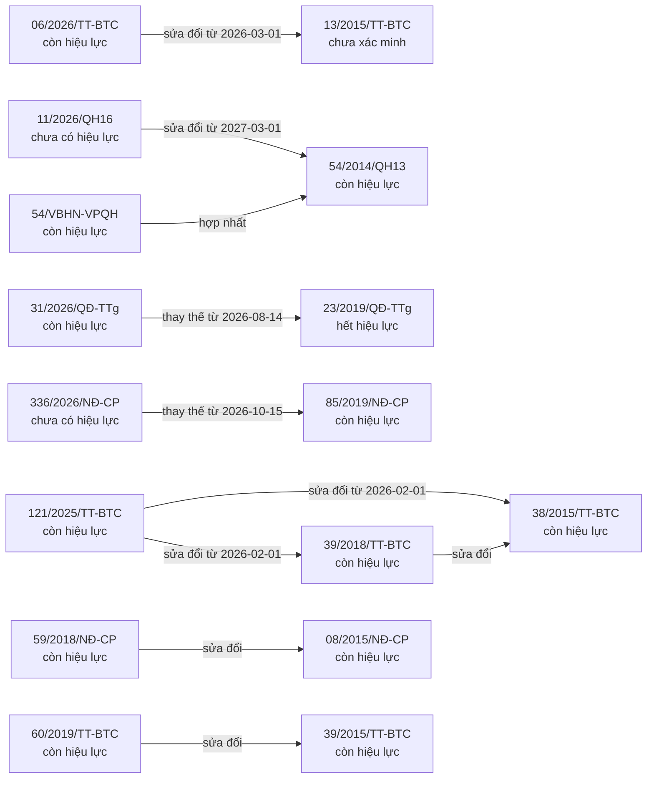
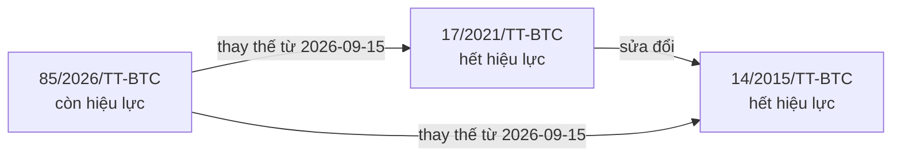
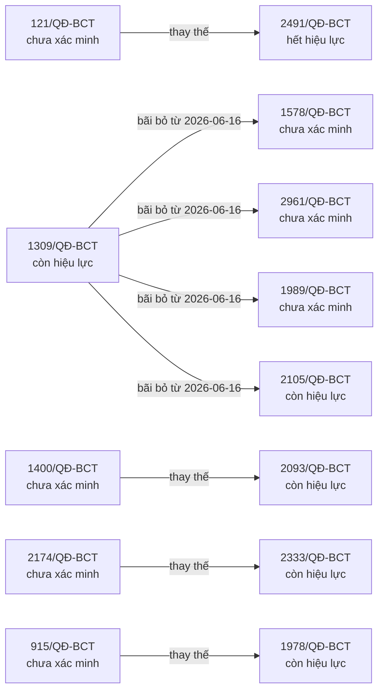
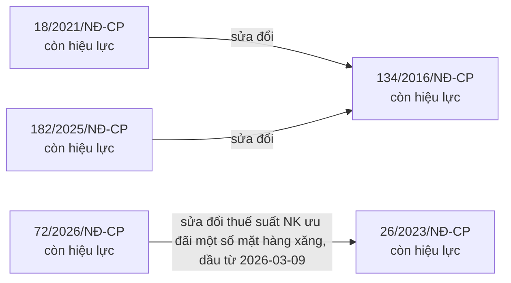
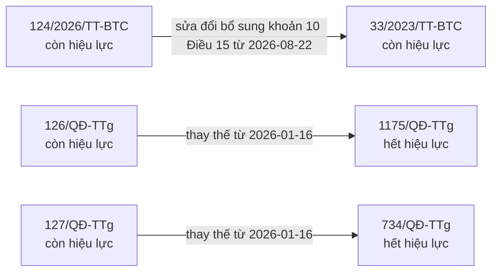

# Quan hệ cũ – mới giữa các văn bản — 2026-10-10

Mũi tên đi từ văn bản MỚI tới văn bản bị tác động. Sinh tự động bằng `node tools/dung.mjs`.

## Hải quan — luật, thủ tục, kiểm tra giám sát



## Kiểm tra chuyên ngành (chất lượng, ATTP, kiểm dịch)

```mermaid
flowchart LR
  n_01_2021_TT_BL_TBXH["01/2021/TT-BLĐTBXH<br/>hết hiệu lực"]
  n_22_2018_TT_BL_TBXH["22/2018/TT-BLĐTBXH<br/>hết hiệu lực"]
  n_09_2024_TT_BYT["09/2024/TT-BYT<br/>còn hiệu lực"]
  n_06_2018_TT_BYT["06/2018/TT-BYT<br/>chưa xác minh"]
  n_48_2018_TT_BYT["48/2018/TT-BYT<br/>chưa xác minh"]
  n_03_2021_TT_BYT["03/2021/TT-BYT<br/>chưa xác minh"]
  n_09_2026_NQ_CP["09/2026/NQ-CP<br/>còn hiệu lực"]
  n_46_2026_N__CP["46/2026/NĐ-CP<br/>tạm ngưng"]
  n_105_2016_QH13["105/2016/QH13<br/>còn hiệu lực"]
  n_34_2005_QH11["34/2005/QH11<br/>hết hiệu lực"]
  n_28_2018_QH14["28/2018/QH14<br/>hết hiệu lực"]
  n_44_2024_QH15["44/2024/QH15<br/>còn hiệu lực"]
  n_76_VBHN_VPQH["76-VBHN/VPQH<br/>chưa có trong sổ"]
  n_11_2024_TT_BTTTT["11/2024/TT-BTTTT<br/>còn hiệu lực"]
  n_05_2016_TT_BTTTT["05/2016/TT-BTTTT<br/>chưa xác minh"]
  n_22_2018_TT_BTTTT["22/2018/TT-BTTTT<br/>còn hiệu lực"]
  n_03_2015_TT_BTTTT["03/2015/TT-BTTTT<br/>chưa xác minh"]
  n_09_2013_TT_BTTTT["09/2013/TT-BTTTT<br/>chưa xác minh"]
  n_111_2021_N__CP["111/2021/NĐ-CP<br/>hết hiệu lực"]
  n_43_2017_N__CP["43/2017/NĐ-CP<br/>hết hiệu lực"]
  n_113_2017_N__CP["113/2017/NĐ-CP<br/>hết hiệu lực"]
  n_108_2008_N__CP["108/2008/NĐ-CP<br/>hết hiệu lực"]
  n_26_2011_N__CP["26/2011/NĐ-CP<br/>hết hiệu lực"]
  n_15_2024_TT_BYT["15/2024/TT-BYT<br/>còn hiệu lực"]
  n_28_2021_TT_BYT["28/2021/TT-BYT<br/>chưa xác minh"]
  n_15_2026_NQ_CP["15/2026/NQ-CP<br/>còn hiệu lực"]
  n_16_2024_TT_BYT["16/2024/TT-BYT<br/>còn hiệu lực"]
  n_09_2018_TT_BYT["09/2018/TT-BYT<br/>hết hiệu lực"]
  n_16_2026_TT_BNV["16/2026/TT-BNV<br/>còn hiệu lực"]
  n_26_2018_TT_BL_TBXH["26/2018/TT-BLĐTBXH<br/>chưa xác minh"]
  n_13_2024_TT_BL_TBXH["13/2024/TT-BLĐTBXH<br/>chưa xác minh"]
  n_09_2025_TT_BNV["09/2025/TT-BNV<br/>chưa xác minh"]
  n_163_2025_N__CP["163/2025/NĐ-CP<br/>còn hiệu lực"]
  n_54_2017_N__CP["54/2017/NĐ-CP<br/>hết hiệu lực"]
  n_17_2023_TT_BNNPTNT["17/2023/TT-BNNPTNT<br/>còn hiệu lực"]
  n_924_Q__BNN_TCLN["924/QĐ-BNN-TCLN<br/>hết hiệu lực"]
  n_1725_Q__BCT["1725/QĐ-BCT<br/>còn hiệu lực"]
  n_1182_Q__BCT["1182/QĐ-BCT<br/>hết hiệu lực một phần"]
  n_19_2024_TT_BYT["19/2024/TT-BYT<br/>còn hiệu lực"]
  n_14_2018_TT_BYT["14/2018/TT-BYT<br/>chưa có trong sổ"]
  n_24_2026_TT_BYT["24/2026/TT-BYT<br/>còn hiệu lực"]
  n_05_2022_TT_BYT["05/2022/TT-BYT<br/>còn hiệu lực"]
  n_59_2025_TT_BYT["59/2025/TT-BYT<br/>chưa có trong sổ"]
  n_26_2026_N__CP["26/2026/NĐ-CP<br/>còn hiệu lực"]
  n_82_2022_N__CP["82/2022/NĐ-CP<br/>hết hiệu lực"]
  n_28_2026_TT_BCT["28/2026/TT-BCT<br/>còn hiệu lực"]
  n_29_2025_TT_BKHCN["29/2025/TT-BKHCN<br/>hết hiệu lực"]
  n_02_2024_TT_BTTTT["02/2024/TT-BTTTT<br/>chưa xác minh"]
  n_33_2026_TT_BCT["33/2026/TT-BCT<br/>còn hiệu lực"]
  n_41_2023_TT_BCT["41/2023/TT-BCT<br/>hết hiệu lực"]
  n_36_2026_TT_BKHCN["36/2026/TT-BKHCN<br/>còn hiệu lực"]
  n_30_2011_TT_BTTTT["30/2011/TT-BTTTT<br/>chưa xác minh"]
  n_15_2018_TT_BTTTT["15/2018/TT-BTTTT<br/>chưa xác minh"]
  n_10_2020_TT_BTTTT["10/2020/TT-BTTTT<br/>chưa xác minh"]
  n_58_2015_TTLT_BCT_BKHCN["58/2015/TTLT-BCT-BKHCN<br/>chưa xác minh"]
  n_01_2009_TT_BKHCN["01/2009/TT-BKHCN<br/>hết hiệu lực"]
  n_366_Q__BKHCN["366/QĐ-BKHCN<br/>chưa xác minh"]
  n_2711_Q__BKHCN["2711/QĐ-BKHCN<br/>chưa xác minh"]
  n_367_Q__BKHCN["367/QĐ-BKHCN<br/>chưa xác minh"]
  n_37_2026_N__CP["37/2026/NĐ-CP<br/>còn hiệu lực"]
  n_132_2008_N__CP["132/2008/NĐ-CP<br/>hết hiệu lực"]
  n_74_2018_N__CP["74/2018/NĐ-CP<br/>hết hiệu lực"]
  n_154_2018_N__CP["154/2018/NĐ-CP<br/>hết hiệu lực một phần"]
  n_13_2022_N__CP["13/2022/NĐ-CP<br/>hết hiệu lực"]
  n_41_2026_TT_BXD["41/2026/TT-BXD<br/>còn hiệu lực"]
  n_10_2024_TT_BXD["10/2024/TT-BXD<br/>hết hiệu lực"]
  n_15_2018_N__CP["15/2018/NĐ-CP<br/>còn hiệu lực"]
  n_4814_Q__BCA["4814/QĐ-BCA<br/>chưa xác minh"]
  n_8378_Q__BCA["8378/QĐ-BCA<br/>chưa xác minh"]
  n_49_2026_TT_BXD["49/2026/TT-BXD<br/>còn hiệu lực"]
  n_12_2022_TT_BGTVT["12/2022/TT-BGTVT<br/>hết hiệu lực"]
  n_62_2024_TT_BGTVT["62/2024/TT-BGTVT<br/>hết hiệu lực"]
  n_71_2025_TT_BXD["71/2025/TT-BXD<br/>chưa xác minh"]
  n_78_2025_QH15["78/2025/QH15<br/>còn hiệu lực"]
  n_05_2007_QH12["05/2007/QH12<br/>còn hiệu lực"]
  n_6266_Q__BCA["6266/QĐ-BCA<br/>chưa xác minh"]
  n_01_2021_TT_BL_TBXH -->|thay thế từ 2021-07-18| n_22_2018_TT_BL_TBXH
  n_09_2024_TT_BYT -->|bãi bỏ từ 2024-07-26| n_06_2018_TT_BYT
  n_09_2024_TT_BYT -->|bãi bỏ từ 2024-07-26| n_48_2018_TT_BYT
  n_09_2024_TT_BYT -->|bãi bỏ từ 2024-07-26| n_03_2021_TT_BYT
  n_09_2026_NQ_CP -->|tạm ngưng| n_46_2026_N__CP
  n_105_2016_QH13 -->|thay thế từ 2017-01-01| n_34_2005_QH11
  n_105_2016_QH13 -->|sửa đổi Một số điều liên quan đến quy hoạch từ 2019-01-01| n_28_2018_QH14
  n_105_2016_QH13 -->|sửa đổi Sửa đổi, bổ sung một số điều Luật Dược (Điều 2, 11, 13, 29, 34, 38, 41, 54, 60, 69...) từ 2025-07-01| n_44_2024_QH15
  n_105_2016_QH13 -->|hợp nhất Văn bản hợp nhất toàn bộ Luật 105/2016, 28/2018, 44/2024 từ 2026-03-01| n_76_VBHN_VPQH
  n_11_2024_TT_BTTTT -->|sửa đổi từ 2024-11-07| n_05_2016_TT_BTTTT
  n_11_2024_TT_BTTTT -->|sửa đổi Điều 1 từ 2024-11-07| n_22_2018_TT_BTTTT
  n_11_2024_TT_BTTTT -->|sửa đổi từ 2024-11-07| n_03_2015_TT_BTTTT
  n_11_2024_TT_BTTTT -->|sửa đổi nhóm 2.1.2 Phụ lục số 02 từ 2024-11-07| n_09_2013_TT_BTTTT
  n_111_2021_N__CP -->|sửa đổi| n_43_2017_N__CP
  n_113_2017_N__CP -->|thay thế từ 2017-11-25| n_108_2008_N__CP
  n_113_2017_N__CP -->|thay thế từ 2017-11-25| n_26_2011_N__CP
  n_15_2024_TT_BYT -->|thay thế từ 2024-11-02| n_28_2021_TT_BYT
  n_15_2026_NQ_CP -->|tạm ngưng| n_46_2026_N__CP
  n_16_2024_TT_BYT -->|bãi bỏ từ 2024-11-15| n_09_2018_TT_BYT
  n_16_2026_TT_BNV -->|thay thế từ 2026-07-28| n_01_2021_TT_BL_TBXH
  n_16_2026_TT_BNV -->|thay thế từ 2026-07-28| n_26_2018_TT_BL_TBXH
  n_16_2026_TT_BNV -->|thay thế từ 2026-07-28| n_13_2024_TT_BL_TBXH
  n_16_2026_TT_BNV -->|bãi bỏ Điều 16 từ 2026-07-28| n_09_2025_TT_BNV
  n_163_2025_N__CP -->|thay thế từ 2025-07-01| n_54_2017_N__CP
  n_17_2023_TT_BNNPTNT -->|bãi bỏ từ 2024-01-30| n_924_Q__BNN_TCLN
  n_1725_Q__BCT -->|thay thế Phụ lục II từ 2024-07-01| n_1182_Q__BCT
  n_19_2024_TT_BYT -->|thay thế từ 2024-11-16| n_14_2018_TT_BYT
  n_24_2026_TT_BYT -->|sửa đổi| n_05_2022_TT_BYT
  n_24_2026_TT_BYT -->|sửa đổi Điều 8 (lộ trình kiểm định) từ 2026-07-01| n_05_2022_TT_BYT
  n_24_2026_TT_BYT -->|bãi bỏ từ 2026-07-01| n_59_2025_TT_BYT
  n_26_2026_N__CP -->|thay thế từ 2026-01-17| n_113_2017_N__CP
  n_26_2026_N__CP -->|thay thế từ 2026-01-17| n_82_2022_N__CP
  n_28_2026_TT_BCT -->|bãi bỏ Khoản 1 Điều 2 và Phụ lục 2 (danh mục ATTP) từ 2026-07-17| n_1182_Q__BCT
  n_29_2025_TT_BKHCN -->|thay thế từ 2025-12-31| n_02_2024_TT_BTTTT
  n_33_2026_TT_BCT -->|thay thế| n_41_2023_TT_BCT
  n_36_2026_TT_BKHCN -->|thay thế từ 2026-07-01| n_29_2025_TT_BKHCN
  n_36_2026_TT_BKHCN -->|thay thế từ 2026-07-01| n_30_2011_TT_BTTTT
  n_36_2026_TT_BKHCN -->|thay thế từ 2026-07-01| n_15_2018_TT_BTTTT
  n_36_2026_TT_BKHCN -->|thay thế từ 2026-07-01| n_10_2020_TT_BTTTT
  n_36_2026_TT_BKHCN -->|thay thế từ 2026-07-01| n_58_2015_TTLT_BCT_BKHCN
  n_36_2026_TT_BKHCN -->|thay thế từ 2026-07-01| n_01_2009_TT_BKHCN
  n_366_Q__BKHCN -->|sửa đổi| n_2711_Q__BKHCN
  n_367_Q__BKHCN -->|sửa đổi| n_2711_Q__BKHCN
  n_37_2026_N__CP -->|bãi bỏ từ 2026-07-01| n_132_2008_N__CP
  n_37_2026_N__CP -->|bãi bỏ từ 2026-07-01| n_74_2018_N__CP
  n_37_2026_N__CP -->|bãi bỏ Điều 4 từ 2026-07-01| n_154_2018_N__CP
  n_37_2026_N__CP -->|bãi bỏ từ 2026-07-01| n_13_2022_N__CP
  n_37_2026_N__CP -->|bãi bỏ từ 2026-01-23| n_43_2017_N__CP
  n_37_2026_N__CP -->|bãi bỏ từ 2026-01-23| n_111_2021_N__CP
  n_41_2026_TT_BXD -->|thay thế| n_10_2024_TT_BXD
  n_44_2024_QH15 -->|sửa đổi Điều 2 (giải thích từ ngữ), Điều 11 (chứng chỉ hành nghề), khoản 4, 5, 9, điểm a và c khoản 18, điểm d và đ khoản 32, khoản 33, 39, 43 Điều 1 từ 2025-07-01| n_105_2016_QH13
  n_46_2026_N__CP -->|thay thế| n_15_2018_N__CP
  n_4814_Q__BCA -->|bãi bỏ từ 2026-07-28| n_8378_Q__BCA
  n_49_2026_TT_BXD -->|bãi bỏ từ 2026-07-01| n_12_2022_TT_BGTVT
  n_49_2026_TT_BXD -->|bãi bỏ từ 2026-07-01| n_62_2024_TT_BGTVT
  n_49_2026_TT_BXD -->|bãi bỏ Chương X, Phụ lục II và Phụ lục III từ 2026-07-01| n_71_2025_TT_BXD
  n_62_2024_TT_BGTVT -->|sửa đổi khoản 2–3 Điều 3; Điều 6–7; thay Phụ lục I–II từ 2025-02-15| n_12_2022_TT_BGTVT
  n_78_2025_QH15 -->|sửa đổi| n_05_2007_QH12
  n_82_2022_N__CP -->|sửa đổi| n_113_2017_N__CP
  n_8378_Q__BCA -->|thay thế từ 2025-10-14| n_6266_Q__BCA
```

## Phân loại hàng hoá (mã HS)



## Phòng vệ thương mại (chống bán phá giá, chống trợ cấp, tự vệ)



## Quản lý ngoại thương

```mermaid
flowchart LR
  n_01_2024_TT_BNNPTNT["01/2024/TT-BNNPTNT<br/>còn hiệu lực"]
  n_11_2021_TT_BNNPTNT["11/2021/TT-BNNPTNT<br/>chưa xác minh"]
  n_16_2021_TT_BNNPTNT["16/2021/TT-BNNPTNT<br/>chưa xác minh"]
  n_01_2022_TT_BNNPTNT["01/2022/TT-BNNPTNT<br/>chưa xác minh"]
  n_07_2023_TT_NHNN["07/2023/TT-NHNN<br/>còn hiệu lực"]
  n_38_2018_TT_NHNN["38/2018/TT-NHNN<br/>chưa xác minh"]
  n_07_2026_TT_BCT["07/2026/TT-BCT<br/>còn hiệu lực"]
  n_37_2013_TT_BCT["37/2013/TT-BCT<br/>hết hiệu lực một phần"]
  n_08_2023_TT_BCT["08/2023/TT-BCT<br/>hết hiệu lực một phần"]
  n_12_2018_TT_BCT["12/2018/TT-BCT<br/>hết hiệu lực một phần"]
  n_41_2019_TT_BCT["41/2019/TT-BCT<br/>hết hiệu lực một phần"]
  n_10_2022_TT_BTTTT["10/2022/TT-BTTTT<br/>còn hiệu lực"]
  n_13_2018_TT_BTTTT["13/2018/TT-BTTTT<br/>chưa xác minh"]
  n_11_2018_TT_BTTTT["11/2018/TT-BTTTT<br/>còn hiệu lực"]
  n_31_2015_TT_BTTTT["31/2015/TT-BTTTT<br/>chưa xác minh"]
  n_11_2026_TT_BXD["11/2026/TT-BXD<br/>còn hiệu lực"]
  n_04_2021_TT_BXD["04/2021/TT-BXD<br/>hết hiệu lực"]
  n_04_2014_TT_BCT["04/2014/TT-BCT<br/>hết hiệu lực"]
  n_11_2017_TT_BCT["11/2017/TT-BCT<br/>hết hiệu lực"]
  n_49_2015_TT_BCT["49/2015/TT-BCT<br/>hết hiệu lực"]
  n_13_2023_Q__TTg["13/2023/QĐ-TTg<br/>còn hiệu lực"]
  n_28_2020_Q__TTg["28/2020/QĐ-TTg<br/>chưa xác minh"]
  n_173_2018_TT_BQP["173/2018/TT-BQP<br/>còn hiệu lực"]
  n_40_2017_TT_BQP["40/2017/TT-BQP<br/>chưa xác minh"]
  n_22_2018_TT_BTTTT["22/2018/TT-BTTTT<br/>còn hiệu lực"]
  n_16_2015_TT_BTTTT["16/2015/TT-BTTTT<br/>chưa xác minh"]
  n_41_2016_TT_BTTTT["41/2016/TT-BTTTT<br/>chưa xác minh"]
  n_292_2026_N__CP["292/2026/NĐ-CP<br/>còn hiệu lực"]
  n_69_2018_N__CP["69/2018/NĐ-CP<br/>hết hiệu lực"]
  n_33_2025_TT_BCT["33/2025/TT-BCT<br/>còn hiệu lực"]
  n_01_2018_TT_BCT["01/2018/TT-BCT<br/>chưa xác minh"]
  n_34_2025_TT_BCT["34/2025/TT-BCT<br/>còn hiệu lực"]
  n_02_2018_TT_BCT["02/2018/TT-BCT<br/>chưa xác minh"]
  n_42_2019_TT_BCT["42/2019/TT-BCT<br/>hết hiệu lực một phần"]
  n_33_2016_TT_BCT["33/2016/TT-BCT<br/>chưa xác minh"]
  n_51_2018_TT_BCT["51/2018/TT-BCT<br/>chưa xác minh"]
  n_31_2018_TT_BCT["31/2018/TT-BCT<br/>chưa xác minh"]
  n_43_2013_TT_BCT["43/2013/TT-BCT<br/>chưa xác minh"]
  n_48_2026_TT_BCT["48/2026/TT-BCT<br/>còn hiệu lực"]
  n_01_2024_TT_BNNPTNT -->|thay thế từ 2024-03-20| n_11_2021_TT_BNNPTNT
  n_01_2024_TT_BNNPTNT -->|sửa đổi mục 3.1, mục 4, mục 8, mục 9 Phụ lục từ 2024-03-20| n_16_2021_TT_BNNPTNT
  n_01_2024_TT_BNNPTNT -->|sửa đổi bãi bỏ Điều 9 và Phụ lục XXIII từ 2024-03-20| n_01_2022_TT_BNNPTNT
  n_07_2023_TT_NHNN -->|sửa đổi| n_38_2018_TT_NHNN
  n_07_2026_TT_BCT -->|sửa đổi Điều 6–10, bãi Điều 11, thay Phụ lục I–II từ 2026-04-10| n_37_2013_TT_BCT
  n_08_2023_TT_BCT -->|sửa đổi Phụ lục I, Phụ lục II (và các phụ lục khác theo Điều 1) từ 2023-05-16| n_12_2018_TT_BCT
  n_08_2023_TT_BCT -->|sửa đổi từ 2023-05-16| n_41_2019_TT_BCT
  n_10_2022_TT_BTTTT -->|sửa đổi từ 2022-09-15| n_13_2018_TT_BTTTT
  n_11_2018_TT_BTTTT -->|sửa đổi Điều 3 và Phụ lục số 01 từ 2018-11-30| n_31_2015_TT_BTTTT
  n_11_2026_TT_BXD -->|thay thế từ 2026-06-01| n_04_2021_TT_BXD
  n_12_2018_TT_BCT -->|bãi bỏ từ 2018-06-15| n_04_2014_TT_BCT
  n_12_2018_TT_BCT -->|bãi bỏ từ 2018-06-15| n_11_2017_TT_BCT
  n_12_2018_TT_BCT -->|bãi bỏ từ 2018-06-15| n_49_2015_TT_BCT
  n_13_2023_Q__TTg -->|thay thế từ 2023-06-01| n_28_2020_Q__TTg
  n_173_2018_TT_BQP -->|thay thế từ 2019-01-01| n_40_2017_TT_BQP
  n_22_2018_TT_BTTTT -->|thay thế từ 2019-02-12| n_16_2015_TT_BTTTT
  n_22_2018_TT_BTTTT -->|thay thế từ 2019-02-12| n_41_2016_TT_BTTTT
  n_292_2026_N__CP -->|thay thế từ 2026-09-05| n_69_2018_N__CP
  n_33_2025_TT_BCT -->|sửa đổi bãi bỏ điểm c khoản 2 Điều 3; thay thế Phụ lục I từ 2025-07-21| n_01_2018_TT_BCT
  n_34_2025_TT_BCT -->|sửa đổi từ 2025-07-21| n_02_2018_TT_BCT
  n_42_2019_TT_BCT -->|bãi bỏ khoản 6 Điều 1 từ 2020-02-05| n_33_2016_TT_BCT
  n_42_2019_TT_BCT -->|bãi bỏ Điều 4 từ 2020-02-05| n_51_2018_TT_BCT
  n_42_2019_TT_BCT -->|bãi bỏ khoản 20 Điều 1 từ 2020-02-05| n_31_2018_TT_BCT
  n_42_2019_TT_BCT -->|bãi bỏ Điều 29 từ 2020-02-05| n_43_2013_TT_BCT
  n_48_2026_TT_BCT -->|bãi bỏ từ 2026-09-05| n_12_2018_TT_BCT
  n_48_2026_TT_BCT -->|bãi bỏ khoản 1 Điều 1 và Phụ lục I (Phụ lục I còn thực hiện chuyển tiếp đến 31-12-2026 — Điều 21 khoản 3) từ 2026-09-05| n_08_2023_TT_BCT
  n_48_2026_TT_BCT -->|bãi bỏ Điều 3 và Phụ lục III từ 2026-09-05| n_41_2019_TT_BCT
  n_48_2026_TT_BCT -->|bãi bỏ Điều 25 từ 2026-09-05| n_42_2019_TT_BCT
```

## Thuế xuất khẩu, nhập khẩu và các thuế khác khâu nhập khẩu



## Xuất xứ hàng hoá và các hiệp định thương mại tự do



