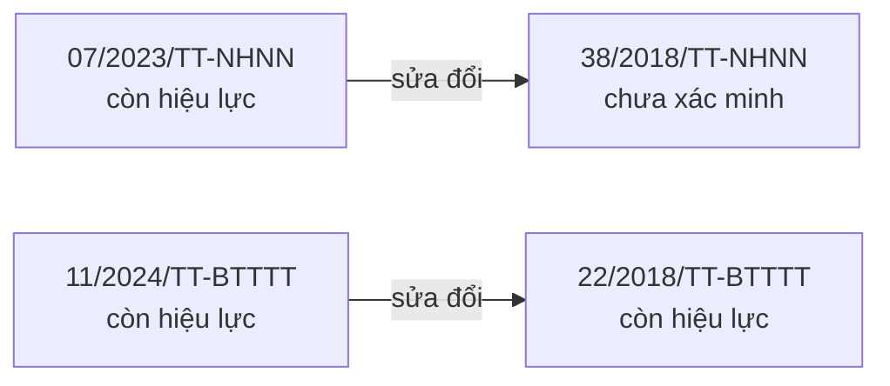
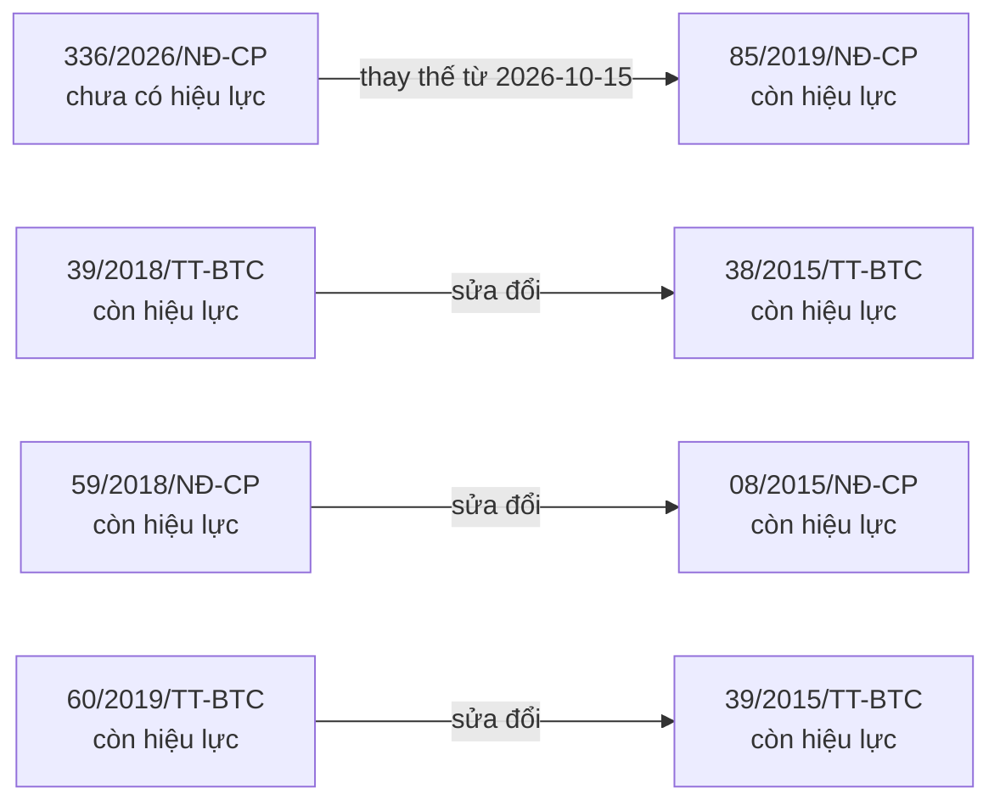
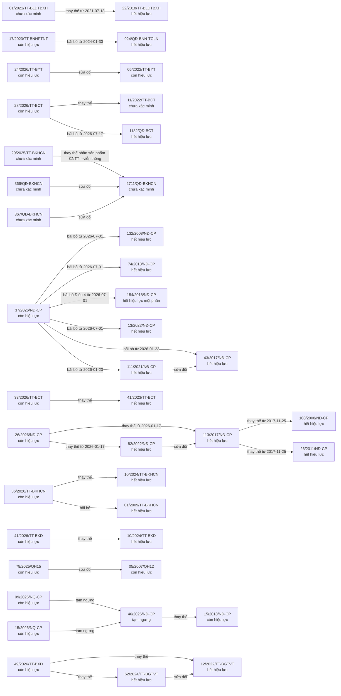
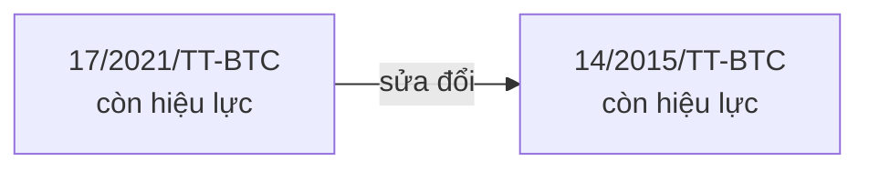
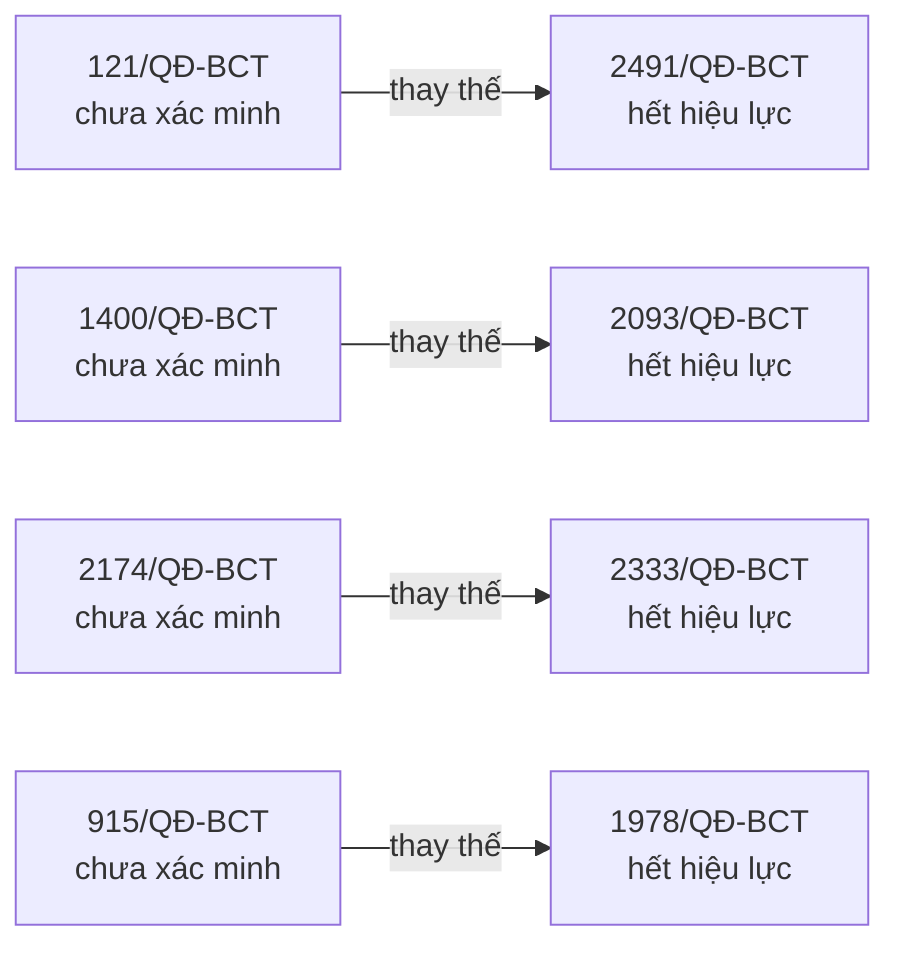
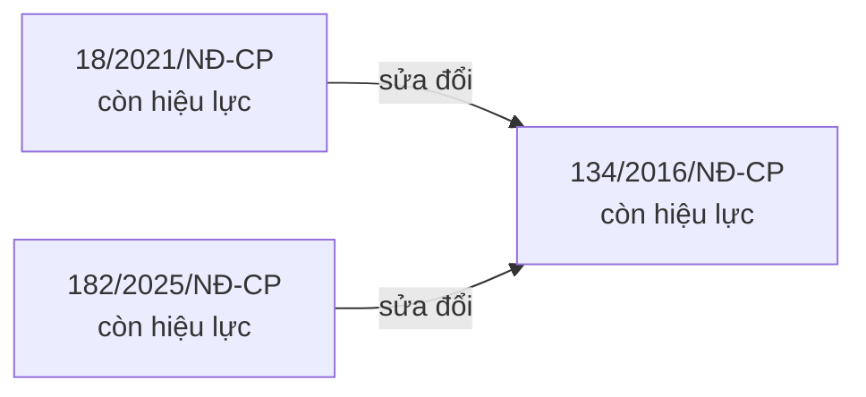
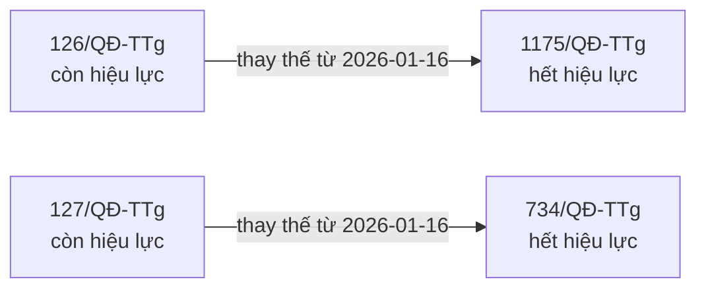

# Quan hệ cũ – mới giữa các văn bản — 2026-10-04

Mũi tên đi từ văn bản MỚI tới văn bản bị tác động. Sinh tự động bằng `node tools/dung.mjs`.

## Chưa phân loại — chờ luồng Hệ thống hoá xếp vào cây



## Hải quan — luật, thủ tục, kiểm tra giám sát



## Kiểm tra chuyên ngành (chất lượng, ATTP, kiểm dịch)



## Phân loại hàng hoá (mã HS)



## Phòng vệ thương mại (chống bán phá giá, chống trợ cấp, tự vệ)



## Quản lý ngoại thương

```mermaid
flowchart LR
  n_07_2026_TT_BCT["07/2026/TT-BCT<br/>còn hiệu lực"]
  n_37_2013_TT_BCT["37/2013/TT-BCT<br/>còn hiệu lực"]
  n_11_2018_TT_BTTTT["11/2018/TT-BTTTT<br/>còn hiệu lực"]
  n_31_2015_TT_BTTTT["31/2015/TT-BTTTT<br/>chưa xác minh"]
  n_11_2026_TT_BXD["11/2026/TT-BXD<br/>chưa xác minh"]
  n_04_2021_TT_BXD["04/2021/TT-BXD<br/>hết hiệu lực"]
  n_12_2018_TT_BCT["12/2018/TT-BCT<br/>hết hiệu lực một phần"]
  n_04_2014_TT_BCT["04/2014/TT-BCT<br/>hết hiệu lực"]
  n_11_2017_TT_BCT["11/2017/TT-BCT<br/>hết hiệu lực"]
  n_49_2015_TT_BCT["49/2015/TT-BCT<br/>hết hiệu lực"]
  n_48_2026_TT_BCT["48/2026/TT-BCT<br/>còn hiệu lực"]
  n_08_2023_TT_BCT["08/2023/TT-BCT<br/>còn hiệu lực"]
  n_41_2019_TT_BCT["41/2019/TT-BCT<br/>còn hiệu lực"]
  n_42_2019_TT_BCT["42/2019/TT-BCT<br/>còn hiệu lực"]
  n_07_2026_TT_BCT -->|sửa đổi| n_37_2013_TT_BCT
  n_11_2018_TT_BTTTT -->|sửa đổi Điều 3 và Phụ lục số 01 từ 2018-11-30| n_31_2015_TT_BTTTT
  n_11_2026_TT_BXD -->|thay thế từ 2026-06-01| n_04_2021_TT_BXD
  n_12_2018_TT_BCT -->|bãi bỏ từ 2018-06-15| n_04_2014_TT_BCT
  n_12_2018_TT_BCT -->|bãi bỏ từ 2018-06-15| n_11_2017_TT_BCT
  n_12_2018_TT_BCT -->|bãi bỏ từ 2018-06-15| n_49_2015_TT_BCT
  n_48_2026_TT_BCT -->|bãi bỏ từ 2026-09-05| n_12_2018_TT_BCT
  n_48_2026_TT_BCT -->|bãi bỏ khoản 1 Điều 1 và Phụ lục I (Phụ lục I còn thực hiện chuyển tiếp đến 31-12-2026 — Điều 21 khoản 3) từ 2026-09-05| n_08_2023_TT_BCT
  n_48_2026_TT_BCT -->|bãi bỏ Điều 3 và Phụ lục III từ 2026-09-05| n_41_2019_TT_BCT
  n_48_2026_TT_BCT -->|bãi bỏ Điều 25 từ 2026-09-05| n_42_2019_TT_BCT
```

## Thuế xuất khẩu, nhập khẩu và các thuế khác khâu nhập khẩu



## Xuất xứ hàng hoá và các hiệp định thương mại tự do



